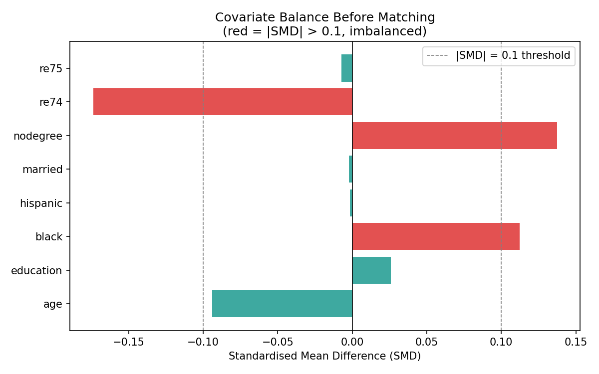
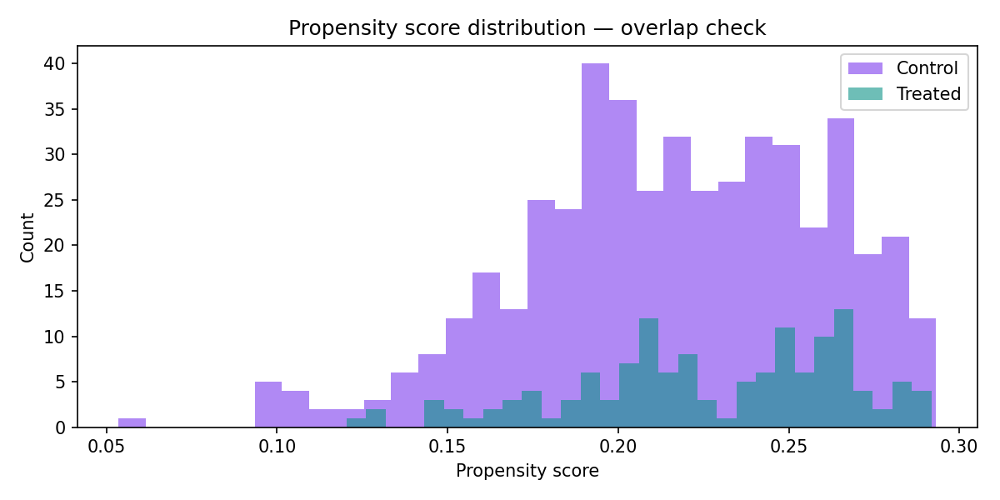
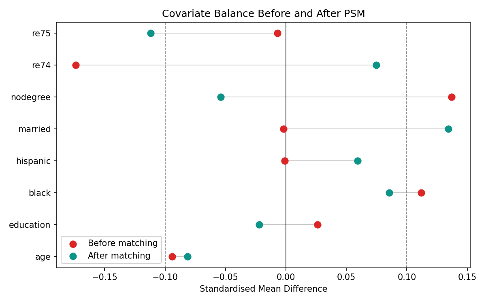
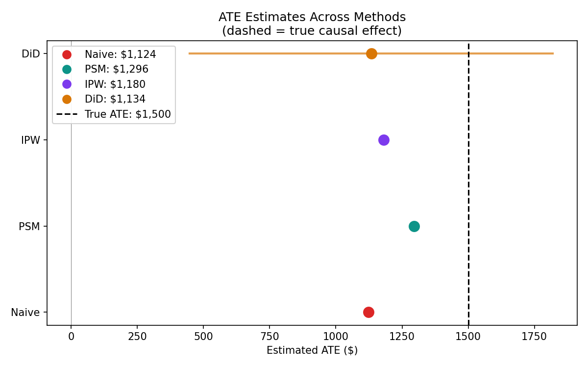
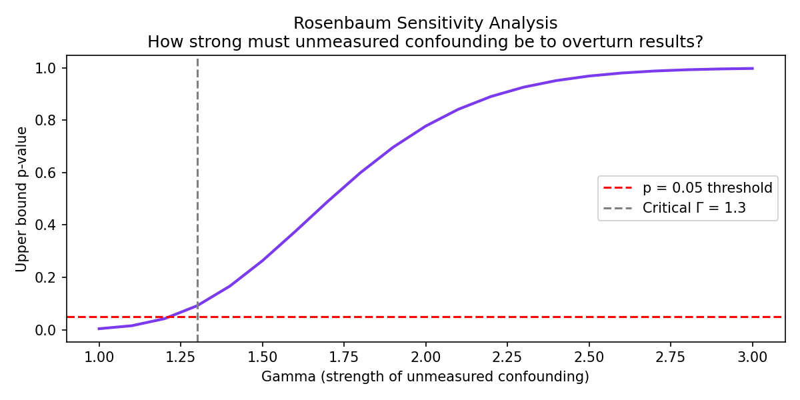

# Causal Inference on Observational Data — Lalonde Job Training

## Overview
Estimation of the causal effect of a job training programme on earnings
using three identification strategies on simulated observational data.
The project demonstrates that correlation ≠ causation and that method
choice matters: the naive estimate is biased by $376 relative to the
true effect.

**True causal effect:** $1,500  
**Naive estimate:** $1,124 (bias = -$376)  
**Best estimate:** PSM at $1,296 (bias = -$204)

---

## Project Structure
```
project/
├── data/
│   └── lalonde.csv         ← simulated dataset (Lalonde statistics)
├── src/
│   ├── load_data.py        ← data generation and inspection
│   ├── naive_comparison.py ← biased baseline + covariate balance
│   ├── propensity_matching.py ← PSM via sklearn
│   ├── ipw.py              ← inverse probability weighting
│   ├── did.py              ← difference in differences via OLS
│   └── sensitivity.py      ← Rosenbaum bounds + ATE comparison plot
├── outputs/
│   ├── covariate_balance_before.png
│   ├── propensity_overlap.png
│   ├── covariate_balance_after_psm.png
│   ├── ate_comparison.png
│   └── sensitivity.png
└── requirements.txt
```

---

## Quickstart
```bash
pip install -r requirements.txt

python src/load_data.py
python src/naive_comparison.py
python src/propensity_matching.py
python src/ipw.py
python src/did.py
python src/sensitivity.py
```

---

## The Fundamental Problem

The naive estimate compares average earnings between people who received
training and those who did not: it's the  difference between expected values in treatment and control
```
Naive ATE = mean(earnings | trained) - mean(earnings | not trained)
          = $8,344 - $7,219 = $1,124
```

This is wrong because the two groups are not comparable. People who sought
training had lower pre-training earnings (`re74` SMD = -0.174) and were
more likely to have no degree (`nodegree` SMD = 0.137). They started from
a worse economic position — comparing raw earnings understates the true
training effect.

> **SMD — Standardised Mean Difference**  
> Measures how different two groups are on a variable, in units of standard
> deviations. Formula: `(mean_treated - mean_control) / pooled_std`
>
> | SMD | Interpretation |
> |-----|----------------|
> | 0.0 | Groups identical on this variable |
> | 0.1 | Small but noticeable difference |
> | 0.5 | Meaningful difference |
> | 1.0 | Large difference — one full standard deviation |
>
> If the two groups are very different on a covariate (high SMD), that
> variable is a **confounder** — it drives who gets treated and potentially
> also the outcome. The rule of thumb is **|SMD| > 0.1** flags a meaningful
> imbalance that needs correcting. That is why it was used as the threshold
> in the love plot — red bars are the confounders adjusted for with PSM,
> IPW, and DiD.



Red bars indicate covariates with |SMD| > 0.1 — meaningful imbalance that
confounds the naive comparison. Three covariates fail this threshold before
any adjustment: `re74` (pre-training earnings), `nodegree` (no degree), and `black`.

This imbalance is the problem. We cannot simply compare treated and control
earnings because the two groups are systematically different people. We need
a method that makes them comparable before computing the effect.

This is exactly what the three methods below do — each one attacks the
confounding problem from a different angle.

---

## Method 1 — Propensity Score Matching (PSM)

### What is PSM and how does it work?

The core idea is to make the treated and control groups comparable by finding
"twins", pairs of one treated and one untreated person who had the same
probability of receiving treatment given their characteristics.

That probability is called the **propensity score**:

```
e(X) = P(treated = 1 | covariates X)
```

It is estimated by fitting a logistic regression where the outcome is whether
someone received training, and the predictors are all the covariates (age,
education, re74, re75, etc.). The model learns: given everything we know about
this person, how likely were they to seek training?

Once every person has a propensity score, matching proceeds in three steps:

```
Step 1: Fit logistic regression → P(treated | age, education, re74, ...)
Step 2: For each treated unit, find the control unit with the closest score
Step 3: Compare outcomes between matched pairs → ATT estimate
```

This produces an estimate of the **ATT (Average Treatment Effect on the
Treated)** : the causal effect for people who actually received training,
not for the population as a whole.

### Overlap check, is matching valid?

Before matching, we must verify that treated and control units have
overlapping propensity scores. If a treated person has a score of 0.9 but
no control unit has a score above 0.5, any match is a fabrication, 
we would be extrapolating into regions with no comparable data.



Both groups cover the same range (0.05–0.30) with substantial overlap
throughout,  matching is valid and no extrapolation is required. Note that
the control group (purple) is much larger than the treated group (teal),
which is expected given the 480 vs 134 split in the dataset. Each treated
unit will find a genuine match within the control pool.

### Did matching improve balance?

After matching, we recheck the SMDs to verify the groups are now comparable.



The key success: `re74` (the strongest confounder before matching) moved from
SMD = -0.174 to SMD = +0.075 it crossed the threshold in the right direction
and the absolute imbalance was nearly halved. `nodegree` also improved
substantially.

However, `married` and `re75` worsened slightly after matching, their dots
moved further from zero. This is a known limitation of simple 1-to-1 nearest
neighbour matching: optimising on one dimension (propensity score proximity)
does not guarantee improvement on every individual covariate. More
sophisticated approaches such as caliper matching or kernel matching can
address this, at the cost of complexity.

**PSM ATT: \$1,296** — bias reduced from \-\$376 to \-\$204 relative to the true effect of \$1,500.

---

## Method 2 — Inverse Probability Weighting (IPW)

### What is IPW and how does it work?

Where PSM discards unmatched units, IPW keeps everyone in the sample but
re-weights each observation so that the treated and control groups
artificially look like a random sample of the population.

The intuition: if treated people tend to be younger (high propensity score
given youth), young treated people are over-represented among the treated
group relative to what we would see in a randomised experiment. IPW
down-weights these over-represented people and up-weights the rare cases, 
the older treated people who are under-represented. After re-weighting, the
treated group looks as if treatment had been assigned randomly.

The weights are defined as:

```
Treated:  w_i = p̄ / P(treated | X_i)
Control:  w_i = (1 − p̄) / P(not treated | X_i)
```

Where `p̄` is the overall proportion of treated units in the dataset.
These are **stabilised weights**  multiplying by the marginal treatment
probability `p̄` rather than using raw `1 / P(treated | X)` reduces the
variance of the estimator. Without stabilisation, a single person with an
extreme propensity score (close to 0 or 1) can receive an enormous weight
and dominate the entire estimate.

The IPW estimator then computes a weighted difference in means:

```
ATE_IPW = Σ[w_i · Y_i · T_i] / Σ[w_i · T_i]
         − Σ[w_i · Y_i · (1−T_i)] / Σ[w_i · (1−T_i)]
```

Unlike PSM which estimates the ATT (effect on the treated only), IPW
estimates the **ATE (Average Treatment Effect)**  the effect for the
entire population, treated and untreated alike.

### Why did IPW underperform PSM here?

The propensity scores ranged from 0.05 to 0.30 in a narrow band. This means
the logistic regression found that treatment assignment was not strongly
predicted by the covariates: most people had a similar probability of
seeking training regardless of their characteristics. When propensity scores
are similar for everyone, re-weighting does not change the sample much, and
IPW has limited power to correct confounding.

IPW works best when there is strong **selection into treatment** when
treated and control units have very different propensity scores, re-weighting
makes a large difference. In this dataset, that condition is not strongly met.

**IPW ATE: \$1,180** — modest improvement over the naive estimate of \$1,124,
but the weakest of the three methods in this setting.

---
## Method 3 — Difference in Differences (DiD)

### What is DiD and how does it work?

PSM and IPW adjust for confounding by balancing observed covariates between
groups. DiD takes a completely different approach: it uses a **before/after
measurement** to control for any fixed differences between groups that do
not change over time.

The logic is straightforward. Even if treated and control people are
different in ways we cannot fully measure, if both groups would have
followed the same earnings trend without treatment, then the difference
in their trends is the treatment effect.

```
DiD = (treated_after − treated_before) − (control_after − control_before)
    = ($8,344 − $777) − ($7,219 − $787)
    = $7,566 − $6,432
    = $1,134
```

Breaking this down:

- **Treated difference** ($7,566): how much did trained people's earnings grow?
- **Control difference** ($6,432): how much did untrained people's earnings grow
  over the same period this is the counterfactual trend.
- **DiD** ($1,134): the excess growth attributable to training, after removing
  the trend that would have happened anyway.

The first difference removes the time trend. The second difference removes
fixed differences between groups. What remains is the treatment effect.

### Estimating DiD via OLS

Rather than computing the four means manually, DiD is estimated as a
regression with an interaction term. The dataset is reshaped to long format
(one row per person per period ) and the following model is fitted:

```
earnings = β0 + β1·treat + β2·period + β3·treat×period + ε
```

Each coefficient has a precise interpretation:

| Coefficient | Meaning | Value |
|-------------|---------|-------|
| β0 | Baseline earnings (control, pre-period) | $787 |
| β1 | Pre-existing earnings gap between groups | −$9.57 (p = 0.969) |
| β2 | Time trend — how much earnings grew for everyone | $6,433 |
| β3 | **DiD estimate — the treatment effect** | **$1,134 (p = 0.0012)** |

### The parallel trends assumption

DiD only identifies the true causal effect if the two groups would have
followed the same earnings trend in the absence of treatment. This is called
the **parallel trends assumption** and it cannot be directly tested — we
never observe the counterfactual.

However, we can partially validate it by checking whether the two groups
had similar earnings *before* treatment. The `β1` coefficient measures
exactly this: the pre-existing earnings gap between treated and control.

Here β1 = −\$9.57 with p = 0.969 — statistically indistinguishable from
zero. Before training, the two groups had essentially identical earnings.
This does not prove parallel trends would have continued, but it is
consistent with the assumption and substantially increases confidence in
the DiD estimate.

### Result

**DiD ATE: \$1,134** — 95% CI [\$447, \$1,820], which contains the true
value of \$1,500. The wide confidence interval reflects that DiD uses only
the pre/post variation in earnings to identify the effect, which is
inherently noisier than methods that leverage the full cross-sectional
variation. The estimate is statistically significant (p = 0.0012) but
less precise than PSM.

---
## Results Comparison



| Method | ATE Estimate | Bias vs Truth | Notes |
|--------|-------------|---------------|-------|
| Naive | \$1,124 | −\$376 | Confounded — no adjustment |
| PSM | \$1,296 | −\$204 | Best point estimate |
| IPW | \$1,180 | −\$320 | Limited by narrow propensity score range |
| DiD | \$1,134 | −\$366 | Widest CI, but contains the truth |
| **True** | **\$1,500** | **—** | Known ground truth (simulated data) |

### Reading the forest plot

Each dot is one method's point estimate. The horizontal bar on DiD is its
95% confidence interval [\$447, \$1,820] the only method for which we
computed a formal interval. The vertical dashed line is the true causal
effect of \$1,500, which we know because the data was simulated.

Three things to notice:

**All causal methods improve on the naive estimate.** The naive \$1,124 is
the furthest left every method that adjusts for confounding moves the
estimate closer to the truth.

**PSM is the best point estimate** at \$1,296, followed by IPW (\$1,180)
and DiD (\$1,134). The ranking reflects how well each method handles
the specific confounding structure in this dataset.

**No method fully recovers the true effect.** All three causal estimates
remain below \$1,500. The residual gap is not a failure of the methods, 
it reflects unmeasured confounding that none of them can adjust for,
since they can only balance on observed covariates. This is the fundamental
limitation of all observational methods, which is why the sensitivity
analysis below matters.

---

## Sensitivity Analysis — Rosenbaum Bounds



### What is Rosenbaum sensitivity analysis?

Every causal conclusion from observational data rests on an untestable
assumption: that we have measured all confounders. If there is an
unmeasured variable that simultaneously affects treatment assignment and
the outcome, our estimates are biased in a way we cannot detect from the
data alone.

Rosenbaum bounds quantify exactly how sensitive our conclusion is to this
possibility. The key parameter is **Γ (Gamma)** : the odds ratio that an
unmeasured confounder would need to create in treatment assignment to
overturn our conclusion.

Formally: if two people are identical on all observed covariates, Γ is the
maximum ratio of their odds of receiving treatment that could be explained
by an unmeasured variable. Γ = 1 means no unmeasured confounding, perfect
randomisation conditional on observed covariates. Γ = 1.3 means the
unmeasured confounder makes one person 30% more likely to receive treatment
than the other.

### Reading the sensitivity curve

The purple curve shows the upper bound on the p-value as Γ increases. At
Γ = 1 (no unmeasured confounding) the p-value is near zero : strong
evidence of a treatment effect. As Γ increases, the worst-case p-value
rises. The red dashed line marks the conventional significance threshold
of p = 0.05.

**Critical Γ = 1.3**  the vertical gray dashed line shows where the
upper bound p-value crosses 0.05. This means an unmeasured confounder
would only need to create a 1.3x odds ratio in treatment assignment to
make our conclusion statistically fragile.

### What does Γ = 1.3 tell us?

This is a relatively low threshold. For context:

- Γ = 1.0 would mean the study is perfectly robust : no hidden confounder
  could overturn it (only possible in a randomised experiment)
- Γ = 2.0 would mean you need a confounder that doubles treatment odds, 
  a strong, meaningful variable
- Γ = 1.3 means a modest confounder suffices — something like motivation
  or family support, which we did not measure, could plausibly create a
  30% difference in who seeks training

In plain English: if there is an unobserved variable that makes someone
30% more likely to seek training AND increases their earnings, our
conclusion could be reversed at the conventional significance level.

### How to interpret this

A low critical Γ is not grounds for abandoning the conclusion, it is
grounds for **intellectual honesty about uncertainty**. The right response
is:

1. Think carefully about what unmeasured confounders might exist in this
   specific domain (motivation, social network, geographic proximity to
   training centres)
2. Collect additional covariates in a follow-up study to reduce sensitivity
3. Report the critical Γ transparently alongside the point estimates so
   decision-makers understand the degree of uncertainty

The three methods converging on a similar range (\$1,124–\$1,296) increases
confidence in the direction of the effect — training raises earnings. The
sensitivity analysis reminds us that the precise magnitude remains uncertain
in the presence of unmeasured confounding.

---

## Key Insight

The value of this project is not the estimates, it is the demonstration
that method choice matters and that all observational estimates carry
uncertainty that a randomised experiment would not. The sensitivity
analysis quantifies exactly how much uncertainty remains after adjustment.

**Using simulated data with a known true effect ($1,500) allows direct
evaluation of each method's performance,  something impossible with real
observational data.**

---

## What I Would Do With More Time
- Implement doubly robust estimation (IPW + outcome model combined)
- Apply targeted maximum likelihood estimation (TMLE)
- Test sensitivity to propensity score model specification
- Compare results under different matching algorithms
  (caliper matching, kernel matching)

## Skills Demonstrated
- Causal inference: PSM, IPW, DiD implemented from scratch
- Covariate balance assessment (SMD, Love plots : before/after
  matching visualisation popularised by Thomas Love)
- Sensitivity analysis: Rosenbaum bounds and critical gamma
- OLS with interaction terms for DiD identification
- Honest interpretation: all methods underestimate, sensitivity is low